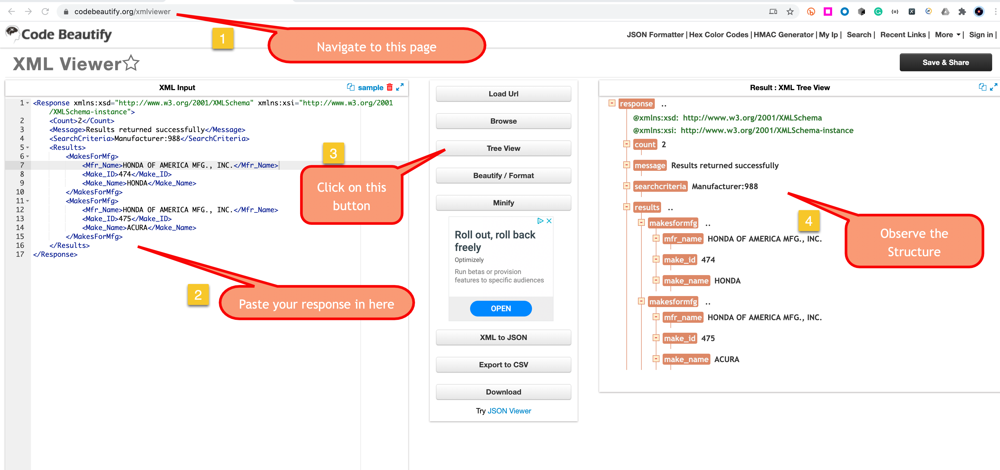
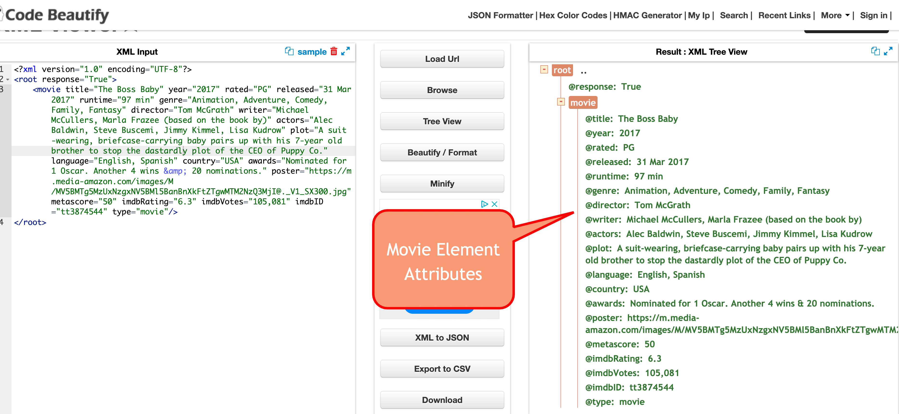
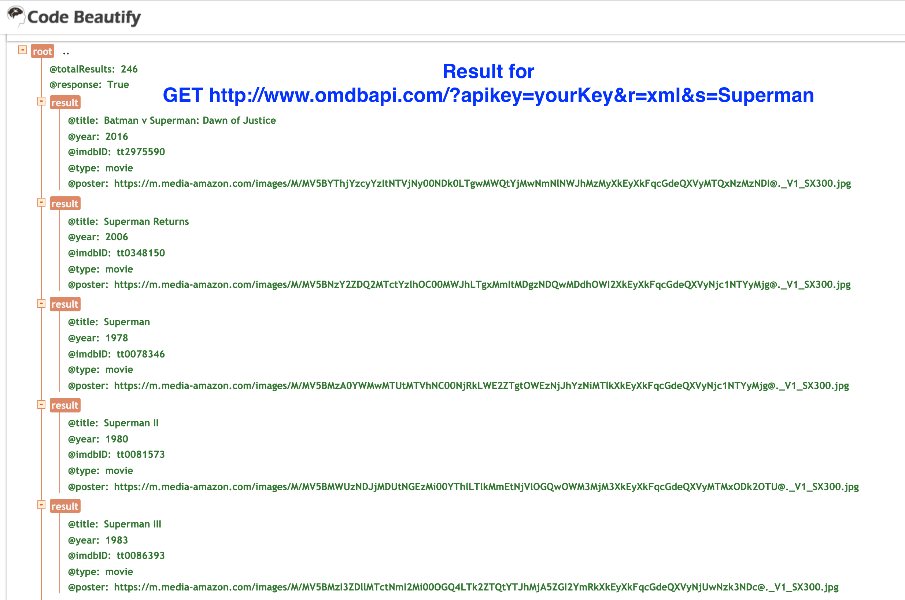

# Day 17 (Day 12 of RestAssured)


## JsonSchema Validation Warm up :

* Add the `AllSpartansSchema.json` and `SearchSchema.json` under resources forlder
* Create a class called `SchemaValidationTest`
  * Add 2 tests:  
    - `GET /spartans` 
    - `GET /spartans/search`
  * Validate the response against the schema in classpath

### Solution 
```java
    when()
        .get("/spartans").
    then()
        .body(matchesJsonSchemaInClasspath("AllSpartansSchema.json") ) ;
```

```java
    // search female in query param
    given()
            .queryParam("gender","Female").
    when()
            .get("/spartans/search").
    then()
            .body(matchesJsonSchemaInClasspath("SearchSchema.json") ) ;
```
> what if my schema file is not under resources folder ? 
> then `matchesJsonSchemaInClasspath` will not work because it only look for schema under resources folder.
 
>We have to use `matchesJsonSchema` method and provide full path

Assuming we have `AllSpartans2Schema.json` under root path. How do we point to that file rather than the one under `src/test/resources` : 

1. Add `AllSpartans2Schema.json` under root path 
2. copy your first test give a different name    
3. Use different method for the path not under `src/test/resources`

Solution : 
```java
 File mySchema = new File("/path/to/your/schema/file.json");
 when()
        .get("/spartans").
 then()
        .body( matchesJsonSchema(mySchema) ) ;
```

### Matcher for Schema 
- `matchesJsonSchemaInClasspath` will only look for schema files under `src/test/resources` folder. 
- `matchesJsonSchema` will look for the schema file according to the path you provided


--- 
## How to work with XML Response 
RestAssured support validating xml response natively using `XMLPath` just like it does for json response using `JSONPath`.

You can use [this website](https://codebeautify.org/xmlviewer#) to see the structure better. 



The Syntax for finding the path is similar to JsonPath 

For example : 
Response for this request is as below for department of transportation api: 

`GET https://vpic.nhtsa.dot.gov/api/vehicles/GetMakeForManufacturer/988?format=xml`

```xml
<Response xmlns:xsd="http://www.w3.org/2001/XMLSchema" xmlns:xsi="http://www.w3.org/2001/XMLSchema-instance">
    <Count>2</Count>
    <Message>Results returned successfully</Message>
    <SearchCriteria>Manufacturer:988</SearchCriteria>
    <Results>
        <MakesForMfg>
            <Mfr_Name>HONDA OF AMERICA MFG., INC.</Mfr_Name>
            <Make_ID>474</Make_ID>
            <Make_Name>HONDA</Make_Name>
        </MakesForMfg>
        <MakesForMfg>
            <Mfr_Name>HONDA OF AMERICA MFG., INC.</Mfr_Name>
            <Make_ID>475</Make_ID>
            <Make_Name>ACURA</Make_Name>
        </MakesForMfg>
    </Results>
</Response>
```
Practice finding the path for elements in XML : 

Path for `Count` element with value of `2` :  

    Response.Count

Path for `Message` element 
    
    Response.Message

The result element has 2 `MakesForMfg` elements similar to json array and it has `3` children as `Mfr_Name`, `Make_ID` ,`Make_Name` . 

Path for first `MakesForMfg` and `Make_ID` : 

    Response.Results.MakesForMfg[0].Make_ID

Path for second `MakesForMfg` and `Make_Name` : 

    Response.Results.MakesForMfg[1].Make_Name

### Validating XML element values

* Send a `GET` Request to above endpoint 
```java
//under before all or directly in the test
RestAssured.baseURI = "https://vpic.nhtsa.dot.gov";
RestAssured.basePath = "api/vehicles";

given()
    .log().all()
    .queryParam("format", "xml").
when()
    .get("/GetMakeForManufacturer/988").

```
* Verify `status code` is `200`
* Verify `Content Type` is `XML`
```java
.statusCode(200)
.contentType(ContentType.XML)
```
* Verify `Count` element value is `2`
```java
.body("Response.Count" , is("2") )
```
* Verify `Message` element value is `Results returned successfully`
```java
.body("Response.Message", is("Results returned successfully"))
```
* Verify under the `results` element first `MakesForMfg` and `Make_ID` is `474`
```java
.body("Response.Results.MakesForMfg[0].Make_ID", is("474"))
```
* Verify under the `results` element second `MakesForMfg` and `Make_Name` is `ACURA`
```java
.body("Response.Results.MakesForMfg[1].Make_Name", is("ACURA"))
```

---- 
### Validating the XML element attribute 

>Unlike JSON, XML elements can have attributes like : 

```html
<span class="label label-success">Optional*</span>
```
`class` here is the attribute and value is `label label-success`. the text of `span` element is  `Optional*`


* Send a request to `GET http://www.omdbapi.com/?t=Boss Baby&r=xml&apikey=yourKeyGoesHere`
* `r` query parameter is used to specify the response type `xml` according to the doc. 
* Verify the response type is actually xml 
* Verify the movie info is expected. 
* The movie info is stored under `<movie>` element attribute. 

> The Response  :
```xml
<?xml version="1.0" encoding="UTF-8"?>
<root response="True">
	<movie title="The Boss Baby" year="2017" rated="PG" released="31 Mar 2017" runtime="97 min" genre="Animation, Adventure, Comedy, Family, Fantasy" director="Tom McGrath" writer="Michael McCullers, Marla Frazee (based on the book by)" actors="Alec Baldwin, Steve Buscemi, Jimmy Kimmel, Lisa Kudrow" plot="A suit-wearing, briefcase-carrying baby pairs up with his 7-year old brother to stop the dastardly plot of the CEO of Puppy Co." language="English, Spanish" country="USA" awards="Nominated for 1 Oscar. Another 4 wins &amp; 20 nominations." poster="https://m.media-amazon.com/images/M/MV5BMTg5MzUxNzgxNV5BMl5BanBnXkFtZTgwMTM2NzQ3MjI@._V1_SX300.jpg" metascore="50" imdbRating="6.3" imdbVotes="105,081" imdbID="tt3874544" type="movie"/>
</root>
```


In order to get to the movie element we would do : 

`root.movie`

In order to get to the movie element attribute 

`root.movie.@attrinuteNameHere`

### Solution :
```java 
 given()
        .log().all()
        .baseUri("http://www.omdbapi.com/")
        .queryParam("apikey", "YOUR KEY HERE")
        .queryParam("r","xml")
        .queryParam("t","The Boss Baby").
when()
        .get().
then().
        log().all()
        .statusCode(200)
        .contentType(ContentType.XML)
        .body("root.movie.@title" , is("The Boss Baby"))
        .body("root.movie.@language", is("English, Spanish"));
        .body("root.movie.@year", is("2017"));
```

--- 

## Practcice XML Response using `GET /Spartans` 

* Create a class called `SpartanXML_Test`
* Add `@BeforeAll` method to set up your baseURI and basePath 
* Create a Test and send `GET /Spartans` by specifying `accept` header as xml. 
* Verify you get `xml` as response `content type`. 
* Verify the first spartan `name`,  `id` , `gender` . 

>The Sample Response
```xml
<List>
    <item>
        <id>31</id>
        <name>Kaye</name>
        <gender>Female</gender>
        <phone>6234567890</phone>
    </item>
    <item>
        <id>290</id>
        <name>Irina Li</name>
        <gender>Female</gender>
        <phone>1231231231</phone>
    </item>
    <item>
        <id>302</id>
        <name>Jazzy</name>
        <gender>Female</gender>
        <phone>4154154151</phone>
    </item>
    <item>
        <id>42</id>
        <name>Adam</name>
        <gender>Female</gender>
        <phone>6234567890</phone>
    </item>
    <item>
        <id>44</id>
        <name>From File</name>
        <gender>Female</gender>
        <phone>6234567890</phone>
    </item>
<List>
```
#### XML path for first `id` , `name` , `gender`

    List.item[0].name
    List.item[0].gender
    List.item[0].id

> Solution 
```java
    given()
            .accept(ContentType.XML).
    when()
            .get("/spartans").
    then()
            .contentType(ContentType.XML)
            .body("List.item[0].name", is("Mina") )
            .body("List.item[0].gender", is("Male"))
            .body("List.item[0].id", is("424"))
```

### Working with `XmlPath` to extract data

```java
//Save the response Object 
Response response = 
        given()
            .accept(ContentType.XML).
        when()
            .get("/spartans") ;
//Get XMLPath object 
XmlPath xp = response.xmlPath();
// use all available get methods like jsonPath
int firstID = xp.getInt("List.item[0].id");

String firstName = xp.getString("List.item[0].name") ;

long firstPhone = xp.getLong("List.item[0].phone");

// get all the ids and store it into the List of Integer
List<Integer> idList = xp.getList("List.item.id" , Integer.class) ;

// get all the phones and store it into the List of Long
List<Long> phoneNums = xp.getList("List.item.phone", Long.class);

// get all the names into List of String
List<String> allNames = xp.getList("List.item.name");
```

### Useful Hamcrest Macthers for Collecion
```java

 List<String> itemList = Arrays.asList("ello", "than", "come", "ease");
// check every item has length of 4 
assertThat( itemList,  everyItem( hasLength(4) ) );

List<Integer> nums = Arrays.asList(1,4,5,6,8,9,10) ;
// check all numbers more than 0
assertThat(nums, everyItem(  greaterThan(0)    )   );
// check all numbers less than 20
assertThat(nums, everyItem(  lessThan(20)    )   );

// allOf --> check multiple condition using AND logic
int myAwesomeNumber = 100 ;
// check the number is more than 0 and less than 50
assertThat(myAwesomeNumber, allOf(  greaterThan(0) , lessThan(50)   )    );

// anyOf --> check multiple condition using OR logic

// check the number is more than 50 or less than 0 
assertThat(myAwesomeNumber, anyOf(greaterThan(50) ,lessThan(0) ) );

// checking all the numbers in the list between 0-50
assertThat(nums, everyItem( allOf( greaterThan(0), lessThan(50) )  ) );


```
                                        
### Getting A List of String out of XML "arrays" item attribute 

You can use this link to import 2 requests both get result in xml format. 


[](https://app.getpostman.com/run-collection/74e9200f46f22b1d8cff)

* Send `GET` request to `http://www.omdbapi.com/?apikey=YourKeyHere&r=xml&s=Superman`
* You will get movie list in `xml` format
* Save the list of `title` attribute of each movies

>Response 
```xml
<root totalResults="246" response="True">
    <result title="Batman v Superman: Dawn of Justice" year="2016" imdbID="tt2975590" type="movie" poster="https://m.media-amazon.com/images/M/MV5BYThjYzcyYzItNTVjNy00NDk0LTgwMWQtYjMwNmNlNWJhMzMyXkEyXkFqcGdeQXVyMTQxNzMzNDI@._V1_SX300.jpg"/>
    <result title="Superman Returns" year="2006" imdbID="tt0348150" type="movie" poster="https://m.media-amazon.com/images/M/MV5BNzY2ZDQ2MTctYzlhOC00MWJhLTgxMmItMDgzNDQwMDdhOWI2XkEyXkFqcGdeQXVyNjc1NTYyMjg@._V1_SX300.jpg"/>
    <result title="Superman" year="1978" imdbID="tt0078346" type="movie" poster="https://m.media-amazon.com/images/M/MV5BMzA0YWMwMTUtMTVhNC00NjRkLWE2ZTgtOWEzNjJhYzNiMTlkXkEyXkFqcGdeQXVyNjc1NTYyMjg@._V1_SX300.jpg"/>
    <result title="Superman II" year="1980" imdbID="tt0081573" type="movie" poster="https://m.media-amazon.com/images/M/MV5BMWUzNDJjMDUtNGEzMi00YThlLTlkMmEtNjVlOGQwOWM3MjM3XkEyXkFqcGdeQXVyMTMxODk2OTU@._V1_SX300.jpg"/>
    <result title="Superman III" year="1983" imdbID="tt0086393" type="movie" poster="https://m.media-amazon.com/images/M/MV5BMzI3ZDllMTctNmI2Mi00OGQ4LTk2ZTQtYTJhMjA5ZGI2YmRkXkEyXkFqcGdeQXVyNjUwNzk3NDc@._V1_SX300.jpg"/>
    <result title="Superman IV: The Quest for Peace" year="1987" imdbID="tt0094074" type="movie" poster="https://m.media-amazon.com/images/M/MV5BMmIwZWY1YTYtNDlhOS00NDRmLWI4MzItNjk2NDc1N2NhYzNlXkEyXkFqcGdeQXVyNTUyMzE4Mzg@._V1_SX300.jpg"/>
    <result title="Superman/Batman: Apocalypse" year="2010" imdbID="tt1673430" type="movie" poster="https://m.media-amazon.com/images/M/MV5BMjk3ODhmNjgtZjllOC00ZWZjLTkwYzQtNzc1Y2ZhMjY2ODE0XkEyXkFqcGdeQXVyNTAyODkwOQ@@._V1_SX300.jpg"/>
    <result title="Superman/Batman: Public Enemies" year="2009" imdbID="tt1398941" type="movie" poster="https://m.media-amazon.com/images/M/MV5BZDc5NTFiMzgtZWJiOS00N2M1LWJmOGYtZmNjMzFhMzcxZjRiXkEyXkFqcGdeQXVyNTAyODkwOQ@@._V1_SX300.jpg"/>
    <result title="Lois &amp; Clark: The New Adventures of Superman" year="1993–1997" imdbID="tt0106057" type="series" poster="https://m.media-amazon.com/images/M/MV5BZTU1ZGFjNzEtZWYzZC00ZmI0LTg2NmMtN2YyNTY4YzhlODIyXkEyXkFqcGdeQXVyMjExMjk0ODk@._V1_SX300.jpg"/>
    <result title="Superman/Doomsday" year="2007" imdbID="tt0934706" type="movie" poster="https://m.media-amazon.com/images/M/MV5BZjU4MzIyZWUtNWQ4Yy00YTU4LTk5NjUtNDBiNDkxZTVlZDgwXkEyXkFqcGdeQXVyNjExODE1MDc@._V1_SX300.jpg"/>
</root>
```

#### Solution : 
```java
Response response = 
    given()
            .log().all()
            .baseUri("http://www.omdbapi.com/")
            .queryParam("apikey", "yourKeyHere")
            .queryParam("r","xml")
            .queryParam("s","superman").
    when()
            .get() ;

        XmlPath xp = response.xmlPath();
        // get the list of movie title
        // getting list of attribute belong to each elements in xml nodes/elements
        List<String> supermanMovieList = xp.getList("root.result.@title") ;
        
        System.out.println("supermanMovieList = " + supermanMovieList);
```


